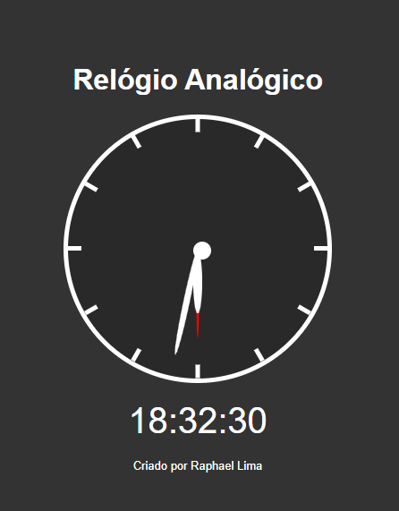

# relogio
Projeto usa JavaScript para simular um relógio de ponteiros e digital.

## Minha aplicação:

## Sobre a aplicação:

A aplicação usa funcionalidades do JavaScript para acessar as horas em tempo real e conforme o tempo passa e manipular o CSS dos ponteiros 
para que eles estejam no angulo correspondente a hora marcada.

## Por que essa aplicação?

O algoritmo foi ensinado pela empresa b7web em um workshop e impletado por mim para prática da lógica de programação e desenvolvimento do portfólio pessoal.

Ficaria feliz com feedBacks:

E-mail: raphaeldesousalm@gmail.com
linkidin: https://www.linkedin.com/in/raphaellima98/
